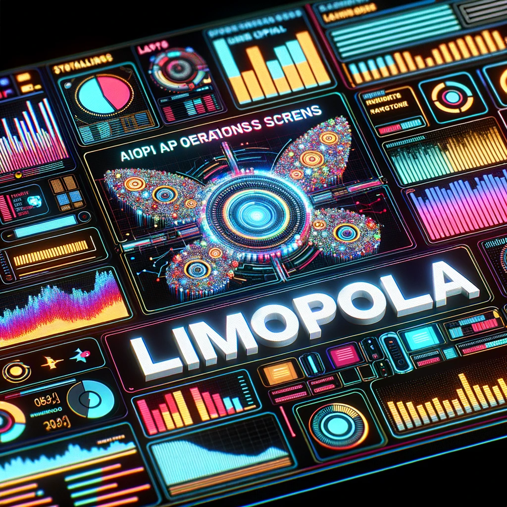

# Limopola: An AI Interface


Limopola is an AI interface to interact with various large language models (LLMs). It allows you to communicate with text, image, video, and audio AI through both chat and editors. Beyond that, it offers many features that the likes of ChatGPT, Google Bard, and Bing AI are missing (at the time of writing). Such features include the ability to remember conversations, setting multiple contexts (as in static prompts that get appended to your prompts), setting properties such as temperature, and starting conversations with one AI and continuing them with another.

The name is a silly portmanteau of the words link, model, portal, and language. Limopola is indeed a portal or a link that allows you to communicate with a wide range of AI's.

The project is built with NextJS (a meta-framework of ReactJS). It uses TypeScript for typing and Jotai for state management. It has a tiny SQLite database that is only used for one table of information. Most information is stored in the client's local storage.

Limopola is made to be run locally, but in the future it might be hosted online on a platform like Netlify.

Originally (regrettably) based on a [simple starter repository by OpenAI](https://github.com/openai/openai-quickstart-node) that grew bigger than planned. Hence the license is inherited from that project.

- [Planned updates to this repository](https://github.com/jacobbergdahl/limopola/blob/main/TODO.md).

## Set-up

The project is quick and easy to set-up, but it requires either an API key from at least one service or setting up a local machine learning model.

### Installation

```bash
$ npm i
```

### Get API keys

Create a `.env` file from the `.env.example` file, and add API keys. There are instructions in the file for where to get the keys.

Note that OpenAI will charge money from the first API call you make, while all other API's are free for a while and do not require any billing information until you reach a certain quota. Hence, if you are just starting out and want to experiment without paying, then you may want to start by just adding the Replicate key.

Be careful when using the `animate-diff` model as it will likely burn through your free period of Replicate quickly.

- `OPENAI_API_KEY`: Used for all versions of GPT and DALL-E. Using OpenAI costs money. Generate the API key at [https://platform.openai.com/account/api-keys](https://platform.openai.com/account/api-keys).
- `REPLICATE_API_KEY`: Used for several API's. These API's are free to use for a while, but eventually you'll be asked to pay to continue using them. Generate the API key for free at [https://replicate.com/account](https://replicate.com/account).
- `ELEVEN_LABS_API_KEY`: Used to generate text-to-speech. This API is also free to use for a while. Generate the API key at [https://docs.elevenlabs.io/api-reference/quick-start/authentication](https://docs.elevenlabs.io/api-reference/quick-start/authentication).
- `GOOGLE_API_KEY`: Used for Google's text-to-speech LLMs (PaLM). This API is also free to use for a while, but may be region-locked. Generate the API key at [https://makersuite.google.com/app/apikey](https://makersuite.google.com/app/apikey).

In the future, this project will likely also give you the option of adding an API key to HuggingFace.

### Set up a local LLM

You can easily use [llama](https://ai.meta.com/resources/models-and-libraries/llama/) locally on your machine in this project.

To set up a local LLM, follow these steps:

1. Install the correct environments by following [this guide](https://github.com/cocktailpeanut/dalai#quickstart). The steps will vary depending on your operating system.
2. Download [this model](https://huggingface.co/TheBloke/airoboros-13b-gpt4-GGML/resolve/main/airoboros-13b-gpt4.ggmlv3.q4_0.bin) and place it in the gitignored `models/` folder.
3. Run `npm i` and `npm run dev`, and then select `local` in the left sidebar, and start interacting with the model.

#### Troubleshooting the local LLM

- [Documentation](https://llama-node.vercel.app/docs/start)
- [Helpful guide](https://blog.devgenius.io/how-to-generate-html-content-with-ai-using-llama-node-and-express-e1b1e0e1a55b)

### Run project

```bash
$ npm run dev
```

## Models

This is a list of models currently included in this AI interface. More models will be added in the future.

| Model               | Type  | API Source |
| ------------------- | ----- | ---------- |
| gpt-4               | Text  | OpenAI     |
| gpt-4-32k           | Text  | OpenAI     |
| gpt-3.5-turbo       | Text  | OpenAI     |
| gpt-3.5-turbo-16k   | Text  | OpenAI     |
| dall-e              | Image | OpenAI     |
| stable-diffusion-xl | Image | Replicate  |
| llama-2-70b         | Text  | Replicate  |
| llama-2-13b         | Text  | Replicate  |
| llama-2-70b-chat    | Text  | Replicate  |
| llama-2-13b-chat    | Text  | Replicate  |
| codellama-34b       | Text  | Replicate  |
| text-to-pokemon     | Image | Replicate  |
| animate-diff        | Video | Replicate  |
| eleven-labs         | Audio | ElevenLabs |
| text-bison-001      | Text  | Google     |
| chat-bison-001      | Text  | Google     |
| local-llama         | Text  | None       |

_And other local/custom versions of these models._

## Modes

Limopola supports three different modes for you to interact with agents.

Note that no matter which mode you choose, Limopola's UI is intentionally made for power users. One example of what this means, is that the UI does not provide confirmation prompts when selecting to reset settings or to clear chat history, and there are currently no tooltips that explain what parameters like "temperature" mean. The UI is meant to be quick and efficient to use for power users.

### Chat

This is the default mode, and the mode where you have the largest number of options. Chat allows you to communicate with AI's in a chat-like format.

Unlike most chat services, this project uses a single chat window for all conversations. This means that you can initiate a conversation with one API, and continue it with another. Your entire chat history is kept in a single instance. On the right-hand side sidebar, you can disable memory, which will make it so that your next message is as if it was an entirely new conversation. You can also clear the memory on the right, or the entire chat history on the left. Note that error messages are not added to your memory.

It's important to really understand the memory setting. With it turned off, the AI will treat all of your messages as the start of a whole new conversation.

Tips:

- The left-hand sidebar is static to each mode (modes being Chat, Editor, and Agent and are selected at the top of the screen), while the right-hand sidebar changes depending on your selected AI model.
- Context, found in the right-hand sidebar, is a saved piece of text that is added above your message. You can use this to have the AI write in your style, learn your tech stack, remember details about you, and much more. The context's are saved in a database that is created in the root directory of this project and is not hosted online.
- Some AI's, like `gpt-4-fact-checker` and `eleven-labs`, allow you to click on any text chat message to instantly send that message to the AI.
- The "reset settings" option will reset everything except for your saved contexts and your chat history.
- You can jump to the textarea by just pressing enter or T.
- You can download and save the conversation as a `.txt` file by pressing CTRL + S / ⌘ + S.

### Editor

The editor mode offers a primitive textarea that you can use to autocomplete text, and only text. In this mode, the text generated by the AI is output into a textarea that you control, so you can edit the text generated by the AI, and then keep generating more text. This is very useful if you want to work together with an AI.

For most purposes in this mode, I would recommend you to _not_ use an LLM fine-tuned for chat. For instance, use `llama-2-70b` instead of `llama-2-70b-chat`.

### Agent

The agent mode is the most recent addition, and it is a mode that is still very early in development. It may crash, and certain actions may not always work correctly. Make sure to keep your console open, as the agent will continuously report its progress.

**Please be careful when using the agent mode. It still needs much testing, and it could potentially make very expensive API calls. Even if you try to stop it, it may already have started an expensive API call that you can't stop.**

This mode allows you to give a mission to an AI agent, and it will autonomously create a list of tasks to solve, and solve the tasks one at a time.

Here's how it works:

1. You enter a mission.
2. The AI will always start by making a list of tasks to accomplish. It also assigns an AI model for solving each task.
3. It will go through the list of tasks from top to bottom, and output a message as it goes down the list.

Examples of missions:

- Create a short illustrated children's book for eight-year olds about a young girl named Ellen who befriends a bird. The book should be ten pages long, and each page should be illustrated with an image. The book should also be narrated.
- Build a fan website about Beethoven. The website should be a single-page application that is accessible and performant. It should feature facts about Beethoven, along with some generated images of him in modern-day scenarios.
- Create a short animated film about the frog Albert who befriends the gentle horse Tampere.
- Make a branding profile for an IT consultancy firm based in Stockholm. The primary color should be indigo.

Currently, this mode _requires_ you to have a number of API keys. It may crash if you don't have `OPENAI_API_KEY`, `REPLICATE_API_KEY`, and `ELEVEN_LABS_API_KEY` set. In the future, users should be able to choose what API's the AI has access to. Currently, that list is limited to a small number of API's.

## Upcoming features

This is a work in progress. You can find a list of planned features and updates in the [TODO.md](https://github.com/jacobbergdahl/limopola/blob/main/TODO.md) file. Please let me know if there are other features you'd like to see added or if you run into any issues. Feel free to open a pull request through a fork with any changes you'd like to make.

## Screenshots

These are example screenshots of the application.

### Chat UI


### Editor UI


## Videos

Below is a video example of dispatching an autonomous AI agent to create a fan website a Super Mario. The agent has been given the following mission:

> Build a fan website about Super Mario. The website should be a single-page application. It should feature facts about Mario, along with some generated images of him in modern-day scenarios.

https://github.com/jacobbergdahl/limopola/assets/13106411/0141e096-ba3d-4452-a10e-6038c09bb6a2

## Limopola artworks

The logo for Limopola by Midjourney v5:


Limopola in text by DALL-E 3:





