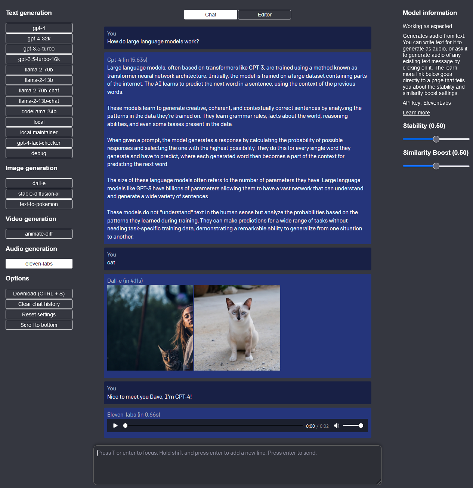
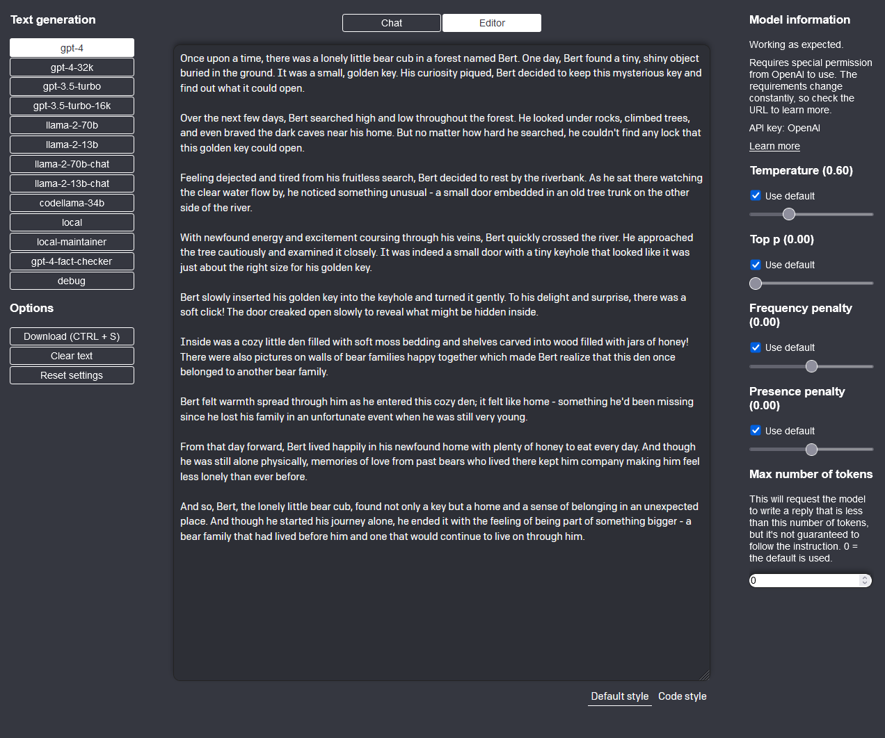

# Limopola: An AI Interface


Limopola is an AI interface to interact with various large language models (LLMs). It is built with NextJS (a meta-framework of ReactJS). It uses TypeScript for typing and Jotai for state management. It has a tiny SQLite database that is only used for one table of information. Most information is stored in the client's local storage.

The name is a silly portmanteau of the words link, model, portal, and language. Limopola is indeed a portal or a link that allows you to communicate with a wide range of AI's.

It allows you to communicate with text, image, video, and audio AI through both chat and editors. Beyond that, it offers many features that the likes of ChatGPT, Google Bard, and Bing AI are missing (at the time of writing). Such features include the ability to remember conversations, setting multiple contexts (as in static prompts that get appended to your prompts), setting properties such as temperature, and starting conversations with one AI and continuing them with another.

Limopola is made to be run locally, but in the future it might be hosted online on a platform like Netlify.

Originally (regrettably) based on a [simple starter repository by OpenAI](https://github.com/openai/openai-quickstart-node) that grew bigger than planned. Hence the license is inherited from that project.

- [Planned updates to this repository](https://github.com/jacobbergdahl/limopola/blob/main/TODO.md).

## Set-up

The project is quick and easy to set-up, but it requires either an API key from at least one service or setting up a local machine learning model.

### Installation

```bash
$ npm i
```

### Get API keys

Create a `.env` file from the `.env.example` file, and add API keys. There are instructions in the file for where to get the keys.

Note that OpenAI will charge money from the first API call you make, while both Replicate and ElevenLabs are free for a while and do not require any billing information until you reach a certain quota. Hence, if you just want to try this project out a little bit, then you can start by just adding the Replicate and/or Eleven Labs API keys.

Be careful when using the `animate-diff` model as it will likely burn through your free period of Replicate quickly.

- `OPENAI_API_KEY`: Used for all versions of GPT and DALL-E. Using OpenAI costs money. Generate the API key at [https://platform.openai.com/account/api-keys](https://platform.openai.com/account/api-keys).
- `REPLICATE_API_KEY`: Used for several API's. These API's are free to use for a while, but eventually you'll be asked to pay to continue using them. Generate the API key for free at [https://replicate.com/account](https://replicate.com/account).
- `ELEVEN_LABS_API_KEY`: Used to generate text-to-speech. This API is also free to use for a while. Generate the API key at [https://docs.elevenlabs.io/api-reference/quick-start/authentication](https://docs.elevenlabs.io/api-reference/quick-start/authentication).

In the future, this project will likely also give you the option of adding an API key to HuggingFace.

### Set up a local LLM

You can easily use [llama](https://ai.meta.com/resources/models-and-libraries/llama/) locally on your machine in this project.

To set up a local LLM, follow these steps:

1. Install the correct environments by following [this guide](https://github.com/cocktailpeanut/dalai#quickstart). The steps will vary depending on your operating system.
2. Download [this model](https://huggingface.co/TheBloke/airoboros-13b-gpt4-GGML/resolve/main/airoboros-13b-gpt4.ggmlv3.q4_0.bin) and place it in the gitignored `models/` folder.
3. Run `npm i` and `npm run dev`, and then select `local` in the left sidebar, and start interacting with the model.

#### Troubleshooting the local LLM

- [Documentation](https://llama-node.vercel.app/docs/start)
- [Helpful guide](https://blog.devgenius.io/how-to-generate-html-content-with-ai-using-llama-node-and-express-e1b1e0e1a55b)

### Run project

```bash
$ npm run dev
```

## Models

This is a list of models currently included in this AI interface. More models will be added in the future.

| Model               | Type  | API Source |
| ------------------- | ----- | ---------- |
| gpt-4               | Text  | OpenAI     |
| gpt-4-32k           | Text  | OpenAI     |
| gpt-3.5-turbo       | Text  | OpenAI     |
| gpt-3.5-turbo-16k   | Text  | OpenAI     |
| dall-e              | Image | OpenAI     |
| stable-diffusion-xl | Image | Replicate  |
| llama-2-70b         | Text  | Replicate  |
| llama-2-13b         | Text  | Replicate  |
| llama-2-70b-chat    | Text  | Replicate  |
| llama-2-13b-chat    | Text  | Replicate  |
| codellama-34b       | Text  | Replicate  |
| text-to-pokemon     | Image | Replicate  |
| animate-diff        | Video | Replicate  |
| eleven-labs         | Audio | ElevenLabs |
| local-llama         | Text  | None       |

_And other local/custom versions of these models._

## Tips

- The left-hand sidebar is static to each mode (modes being Chat and Editor and are selected at the top of the screen), while the right-hand sidebar changes depending on your selected AI model.
- If memory is enabled, all messages in memory will be sent to the AI model alongside your most recent message. As such, the AI will remember your conversation. If memory is disabled, then every message essentially starts a whole new conversation.
- Context is a saved piece of text that is added above your message. You can use this to have the AI write in your style, learn your tech stack, remember details about you, and much more. The context's are saved in a database that is created in the root directory of this project and is not hosted online.
- The "reset settings" option will reset everything except for your saved contexts and your chat history.
- Unlike most chat services, this project uses a single chat window for all conversations. This means that you can initiate a conversation with one API, and continue it with another. Your entire chat history is kept in a single instance. On the right-hand side sidebar, you can disable memory, which will make it so that your next message is as if it was an entirely new conversation. You can also clear the memory on the right, or the entire chat history on the left. Note that error messages are not added to your memory. If `process.env.NEXT_PUBLIC_SHOULD_SHOW_ALL_LOGS` is true, then you can see the exact message that got sent to the back-end in the client side (browser) console. Overall, there is a lot of logging in both the client and server side consoles if you have the variable set to `true`.
- You can jump to the textarea by just pressing enter or T.
- You can download and save the conversation as a `.txt` file by pressing CTRL + S / CMD + S.
- The UI is intentionally made for power users. One example of what this means, is that the UI does not provide confirmation prompts when selecting to reset settings or to clear chat history.
- You may want to adjust the zoom level of the UI to what works on your screen. Feel free to try zooming in and out.
- Some AI's, like `gpt-4-fact-checker` and `eleven-labs`, allow you to click on any text chat message to instantly send that message to the AI.

## Upcoming features

This is a work in progress. You can find a list of planned features and updates in the [TODO.md](https://github.com/jacobbergdahl/limopola/blob/main/TODO.md) file. Please let me know if there are other features you'd like to see added or if you run into any issues. Feel free to open a pull request through a fork with any changes you'd like to make.

## Screenshots

These are example screenshots of the application taken on 2023-10-11.

### Chat UI



### Editor UI


